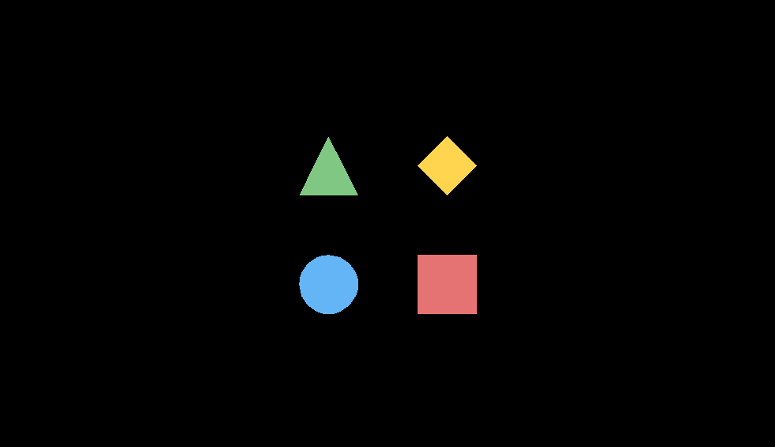
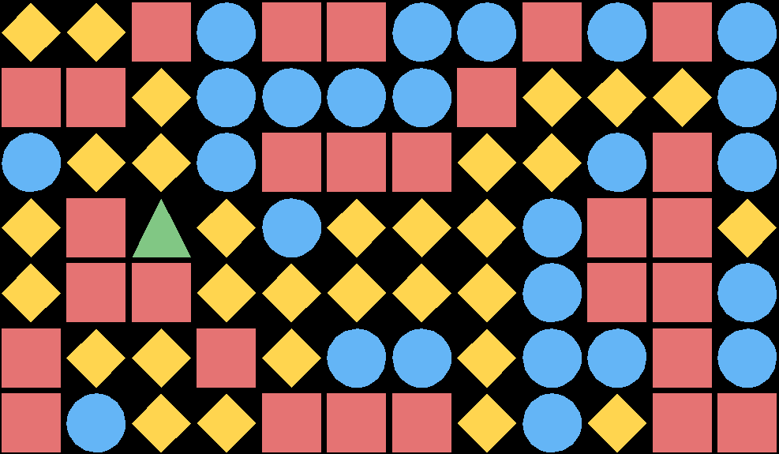
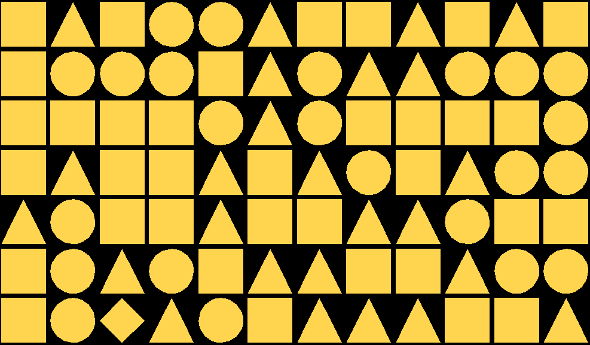
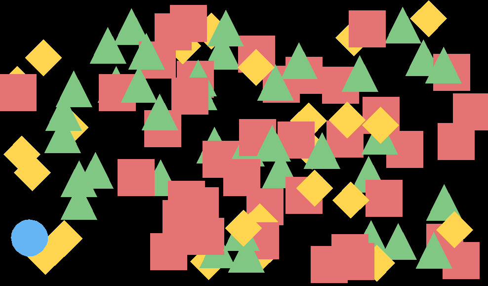

# Wanted!
> Inspired by the nostalgic puzzle minigame from New Super Mario Bros: [Wanted!](https://mario.fandom.com/wiki/Wanted!)
* Developed by _***Jalene Armstrong***_ 
* COMP3609 (Game Programming): Assignment 01

---

### Gameplay
> The goal of this simple game is to find and select the correct shape—square, triangle, circle, or diamond—hidden among the other shapes. At the start of each round, the target shape is displayed, and the player must quickly locate and select it before time runs out. As the levels progress, the difficulty and distraction tactics increase.

> The game begins with a 5-second time limit. Players earn 3 seconds for selecting the correct shape but lose 5 seconds for an incorrect choice. The game ends when time runs out or when they surpass level 50.

---

### Features
* Mouse Interaction
* Multiple Levels
* Increasing Difficulty
* Unexpectedly Intense Gameplay

---

### Level Categories
* ***Easy:*** Levels 1 - 10: Easy peasy as I like to say, you can speedrun these!

* ***Normal:*** Levels 11 - 20: Some interesting levels has appeared but not too crazy!

* ***Hard:*** Levels 21 - 30: You'll see :D

* ***FreeForAll:*** Levels 31 - 50: Anything goes! You can be totally lucky and get all the easy ones, or... not! haha

---

### Level Types

* ***Grid:*** The shapes are neatly arranged in a uniform pattern, making it easy to spot the odd one out!

* ***Mimic:*** Quit mocking me! Here, the other shapes think the wanted shape is the coolest, so they all copy its look. Good luck picking out the real one!

* ***Scatter:*** Shapes are randomly placed across the screen—sometimes right in plain sight, other times doing their best to stay hidden. Keep your eyes sharp!

* ***Flicker:*** Nosferatuuuuuu! The screen flickers, but don’t trust your memory—sometimes the wanted shape won’t always be where you last saw him!

* ***Motion:*** All the shapes move in sync—whether it's downward, to the right, or diagonally!

* ***Relay:*** Pass it on! When shapes collide, they steal colors. Even the wanted shape will blend in, but the wanted poster won’t update—so pay close attention!

> These mechanics mix and match, so you might face a Diagonal Mimic level or a Flicker-Mimic level with randomized positions. _(Those are the worst! Especially with Diamond.)_

---

### Screenshots

